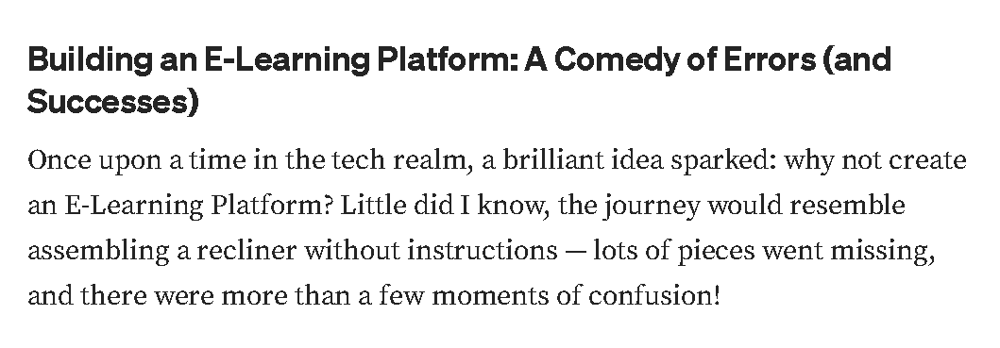

# Umoja E-Learning Platform


## Introduction

UmojaEducationalManager is an E-Learning Platform designed to provide accessible education resources and management tools for both educators and students. The platform offers features such as course management, user enrollment, and interactive learning materials.

[View the deployed site here](not-yet-deployed-site-link)

[Read the final project blog article here](https://medium.com/@davidomuga/building-an-e-learning-platform-a-comedy-of-errors-and-successes-6a97c8cd1cde)

### Author(s)

- [David Odhiambo Ouna](https://www.linkedin.com/in/david-ouma-odhiambo/)

## Installation

To install UmojaEducationalManager locally, follow these steps:

1. Clone the repository:
   ```bash
   git clone git@github.com:DaveOuma/UmojaEducationalManager-UEM.git


## Overview

The Umoja E-Learning Platform is a comprehensive online learning solution built with Django (version X.X). It offers features for course management, user authentication, content rendering, and real-time communication through chat functionalities.

## Table of Contents

* [Getting Started](#getting-started)
* [Project Setup](#project-setup)
* [Key Features](#key-features)
* [Building the Platform](#building-the-platform)
    * [Course Models](#course-models)
    * [Advanced Modeling Techniques](#advanced-modeling-techniques)
    * [Authentication System](#authentication-system)
* [Content Management System](#content-management-system)
* [API Development](#api-development)
* [Chat Server](#chat-server)
* [Going Live](#going-live)
* [Contributing](#contributing)
* [License](#license)

## Getting Started

To get started with the Umoja E-Learning Platform, follow these instructions to set up the project locally.

**Prerequisites:**

* Python 3.x
* Django (version X.X)
* PostgreSQL
* Docker (optional, for deployment)

**Installation:**

1. Clone the repository:

```bash
git clone [git clone git@github.com:DaveOuma/UmojaEducationalManager-UEM.git]
cd UmojoEducationalManager-UEM
Use the code with caution .

Install the required dependencies:
Bash
pip install -r requirements.txt
Use the code with caution .

Project Setup

Create and configure your PostgreSQL database.
Modify the settings.pyfile to include your database credentials.
Run the database migrations:

python manage.py migrate
Use the code with caution .

Create a superuser to access the admin panel:

python manage.py createsuperuser   


Key Features
Course Management: Build and manage courses, modules, and content.
User Authentication: Secure login and registration features.
Content Rendering: Display various content types.
Real-Time Chat: Integrated chat functionality for user interaction.
API Development: RESTful API for course content management.

Building the Platform
This section can be broken down into further details on specific functionalities:

Course -Models
Create -models for courses and their content.
Register -models in the Django administration site for management.
Use -fixtures to provide initial data for models.
Advanced -Modeling Techniques
Implement -polymorphic content through model inheritance (abstract models, multi-table inheritance, and proxy models).
Create -custom model fields and define ordering for modules and content objects.
Authentication System
Develop -authentication views and templates to manage user access.
Content -Management System
Use -class-based views and mixins to enhance functionality.
Manage -course modules and their content with formsets.
Implement -access restrictions using groups and permissions.
API -Development
Install -Django REST framework and define serializers for data handling.
Create -nested serializers and custom API views for complex data structures.
Handle -authentication and permissions for API endpoints.
Chat -Server
Develop -a chat application using Django Channels for asynchronous communication.
Implement -WebSocket clients and configure channel layers with Redis.

Going Live
[Use any desired method]

Contributing
Contributions -to this project are welcome. Please follow these steps to contribute:

Fork -the repository.
Create -a new branch for your feature.   
Make -your changes and submit a pull request.

Licenses
This -project is licensed under the MIT License. See the LICENSE file for details.   


